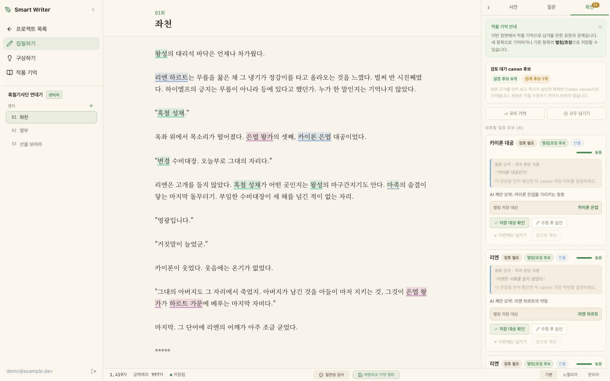
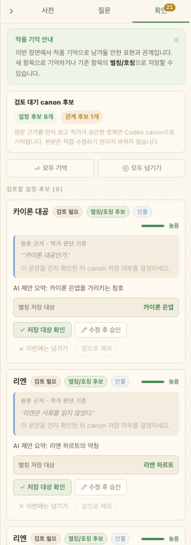
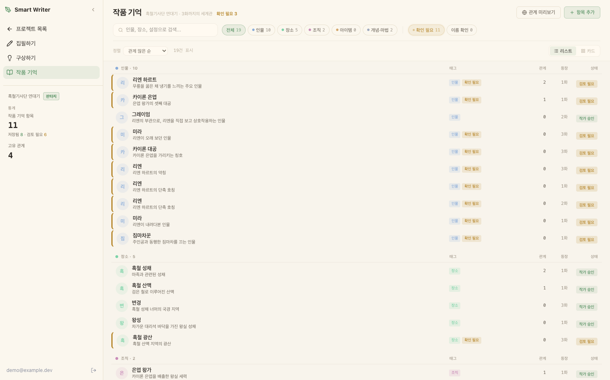
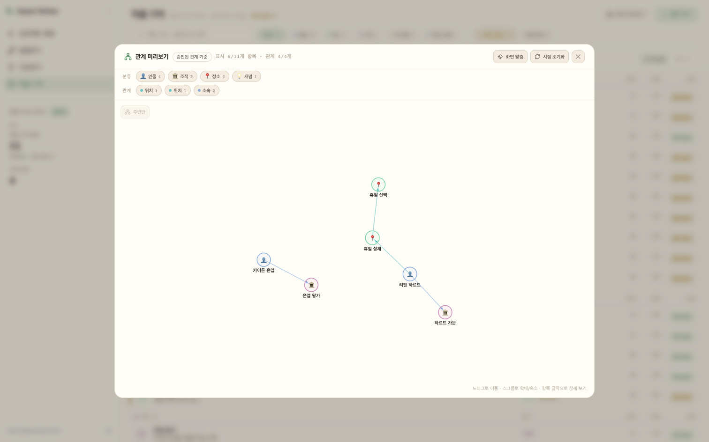
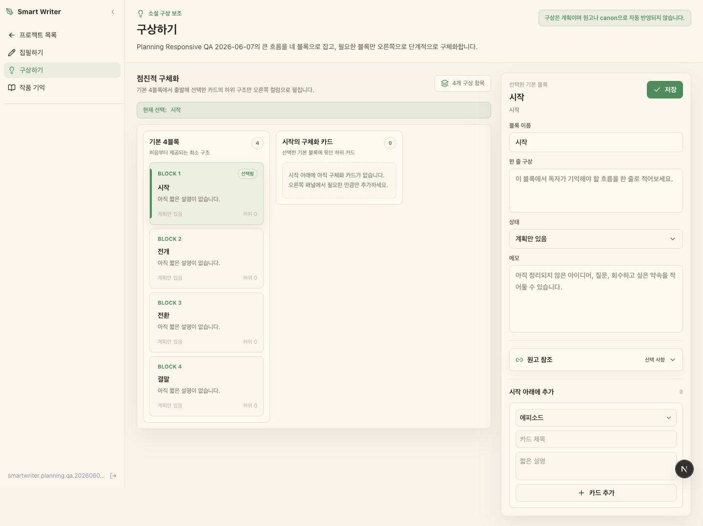

# Smart Writer

[🔗 라이브 데모](https://smart-writer-vq8j.vercel.app/demo) · [English README](./README.en.md) · [](https://github.com/evan506/smart-writer-public/actions/workflows/test.yml)



**웹소설 작가를 위한 근거 기반 설정 일관성 워크스페이스.** 작가가 쓴 원고를 읽고 인물·설정·관계·복선 후보를 제안하되, 각 후보의 **원문 근거**를 함께 보여주고, 작가가 승인한 것만 작품 기억으로 저장합니다.

> 글은 작가가 씁니다. Smart Writer는 원고 속 설정을 잊지 않게 돕습니다.
> **자동 생성 도구가 아닙니다.** AI는 문장을 쓰지 않습니다. 후보를 제안할 뿐이고, 채택 여부는 사람이 결정합니다.

라이브 데모는 [`/demo`](https://smart-writer-vq8j.vercel.app/demo)에서 **회원가입 없이** 집필 → 후보 검토 → 작품 기억 흐름을 바로 볼 수 있습니다.

## Highlights

- **집필 워크스페이스** — Tiptap 커스텀 에디터. debounce 자동저장, 오프라인 감지, 미저장 이탈 경고, 엔티티/경고 인라인 하이라이트.
- **근거 기반 AI 검토** — 엔티티·관계·설정 후보가 *원문 근거*와 함께 도착하고, 작가의 명시적 승인 없이는 캐논에 들어오지 않습니다.
- **인터랙티브 관계 그래프** — d3-force 커스텀 렌더러(줌·팬·노드 드래그, 타입별 노드/엣지).
- **테스트·CI 기반 검증** — 유닛 596개(97파일), Playwright E2E, GitHub Actions CI, Docker 기반 마이그레이션 재생 게이트.

## 제품 흐름

```text
원고를 쓴다
  → AI가 후보를 탐지 (엔티티, 별칭, 관계, 설정)
  → 작가가 후보마다 원문 근거를 확인
  → 작가가 승인
  → 승인된 항목만 작품 기억(코덱스)이 됨
  → 검색·엔티티 상세·관계 그래프·근거 기반 Q&A에서 재사용
```

전 구간을 관통하는 설계 원칙: **AI는 제안하고, 작가가 결정한다.**

## 주요 기능

- **집필 워크스페이스** — Tiptap 기반 데스크톱 에디터. debounce 자동저장(초안 저장 / AI 추출 포함 전체 저장 분리), 오프라인 감지, 미저장 변경 이탈 경고.
- **후보 검토** — 엔티티·별칭·관계·설정이 *검토 후보*로 도착합니다. 자동으로 사실이 되지 않습니다. 각 후보는 원문 근거를 노출합니다.
- **코덱스(작품 기억)** — 승인된 인물·장소·조직·아이템·개념·마법체계와 별칭, 등장 챕터, 근거 이력.
- **하이브리드 검색/RAG** — pgvector 유사도 + PostgreSQL trigram 텍스트 검색 + 그래프 확장을 결합하고 경량 재랭킹.
- **근거 기반 Q&A** — 답변이 어떤 근거에서 나왔는지 인용합니다. 의도적으로 "모든 걸 아는 신탁"이 아닙니다.
- **관계 그래프** — d3-force 기반 인터랙티브 그래프(줌·팬·노드 드래그).
- **점진적 구상** — `시작 / 전개 / 전환 / 결말` 4블록에서 시작해, 작가가 원하는 곳만 하위 카드로 확장합니다.
- **LLM 비용 가드레일** — 프로젝트·사용자 단위 일간/월간 예산 검사. 한도 초과 시 **원고는 정상 저장되고 AI 추출만 중단**되는 그레이스풀 디그레이션.

## 스크린샷

### 1. 후보 검토 (원문 근거)

우측 검토 패널. 엔티티·별칭·관계 후보마다 유래한 원문 근거를 함께 보여주고, 작가가 *저장 / 수정 후 승인 / 넘기기*를 직접 결정합니다.



### 2. 작품 기억(코덱스)

승인된 항목과 검토 후보를 타입별로 정리한 목록. 별칭, 관계 수, 첫 등장 화수, 상태(작가 승인 / 검토 필요)를 한눈에 봅니다.



### 3. 관계 그래프

d3-force 인터랙티브 그래프. 타입별 노드/엣지, 줌·팬·드래그, 항목 클릭 시 상세.



### 4. 점진적 구상

`시작 / 전개 / 전환 / 결말` 4블록에서 필요한 곳만 하위 카드로 드릴다운.



## 기술 스택

| 영역 | 스택 |
|---|---|
| 앱 | Next.js 16 (App Router), React 19, TypeScript |
| 데이터 | Supabase PostgreSQL + pgvector + pg_trgm, Row Level Security |
| 에디터 | Tiptap 3 (커스텀 엔티티/경고 하이라이트 플러그인) |
| UI | Tailwind v4, shadcn/ui + Radix, CVA, 커스텀 디자인 토큰 |
| 시각화 | d3-force (커스텀 인터랙티브 그래프 렌더러) |
| 검증 | Zod |
| LLM | OpenRouter 경유 Claude 계열 모델 + OpenAI 호환 임베딩(`text-embedding-3-small`). 기본 모델은 `.env.example`에서 설정 |
| 테스트 | Vitest, Testing Library, Playwright |
| 툴링 | pnpm 10.25.0, ESLint, knip (dead-code 게이트) |

**UI 상태는 범위에 따라 나눠 관리합니다** — 상호작용 로컬 상태는 React 훅, 공유/새로고침 가능한 상태는 URL 검색 파라미터, 서버 데이터 변경은 Server Actions(`revalidatePath` + `router.refresh`). 현재 제품 규모에서는 별도 전역 스토어를 도입하지 않았습니다.

## 아키텍처 노트

```text
Browser
  └─ Client Components (말단 상호작용만 "use client")
       └─ Server Actions ("use server")
            ├─ 소유권 가드 (requireProjectOwner / requireChapterOwner)
            ├─ 도메인 서비스 (src/lib/services/*)
            └─ Supabase PostgreSQL
                   ├─ RLS (auth.uid())
                   ├─ pgvector / pg_trgm
                   └─ after() 백그라운드 인덱싱·추출
```

- **기본은 서버 컴포넌트.** 데이터 조회는 Server Component에서, 상호작용이 필요한 말단만 `"use client"`. 모든 변경은 `"use server"` 액션을 통과합니다.
- **레이어 분리.** 서버 액션(`*-actions.ts`)은 얇은 어댑터(권한 확인 → 서비스 호출 → revalidate)이고, 비즈니스 로직은 `src/lib/services/`에 있습니다.
- **데이터 격리 다층 방어.** RLS 정책(`auth.uid()`)에 더해, 프로젝트 범위 서버 액션 전부에 소유권 가드를 명시적으로 적용합니다.
- **백그라운드 처리.** 저장 후 인덱싱과 LLM 추출은 `after()`에서 실행되어 저장은 즉시 반환됩니다.
- **Supabase는 서버 전용.** 브라우저용 Supabase 클라이언트가 없습니다.

## 검증

```bash
pnpm lint
pnpm exec tsc --noEmit
pnpm test:run          # 97개 파일, 596개 유닛 테스트
pnpm build
```

건너뛰기 안전한 확장 스위트:

```bash
pnpm test:integration  # SMART_WRITER_INTEGRATION_TESTS=1 없으면 skip
pnpm test:e2e          # 인증 플로우는 SMART_WRITER_AUTH_E2E_TESTS=1 없으면 skip
pnpm db:replay-verify  # Docker 기반 마이그레이션 재생 게이트
```

CI(GitHub Actions)는 lint → knip → typecheck → unit + integration + e2e → build를 돌리고, 별도 job에서 로컬 Supabase를 띄워 DB 기반 검색/RAG 회귀 테스트를 수행합니다.

## 의도적으로 만들지 않은 것

만들지 *않기로* 한 것들입니다. 범위를 지키는 것도 기능입니다:

- AI 자동 집필 / 챕터 생성
- 출판·결제·내보내기·독자용 페이지
- 대량 원고 임포트, 전작품 캐논 헬스 대시보드
- 프로덕션급 설정 충돌 판정
- 장편 전체에 대한 완전한 관계 그래프 진단
- 실사용 검색 품질에 대한 광범위한 주장 (검색 테스트가 증명하는 건 *plumbing과 결정적 recall*이지, 사람이 판단한 관련성이 아닙니다)
- 캐릭터 챗 / 독자 롤플레이

## 빠르게 체험하기

- **호스팅 데모**: <https://smart-writer-vq8j.vercel.app/demo>
- `/demo`에서 원클릭 로그인 — 별도 회원가입이나 개인 API 키 불필요
- 시드된 「흑철기사단 연대기」 3화로 집필 → 후보 검토 → 작품 기억 흐름을 그대로 확인

## 로컬 개발

준비물: Node.js + Corepack, Supabase(기존 프로젝트 또는 로컬용 Supabase CLI + Docker), `OPENROUTER_API_KEY`.

```bash
corepack prepare pnpm@10.25.0 --activate
pnpm install
```

**A. 로컬 Supabase 사용** — DB를 먼저 띄우고, 출력된 값을 `.env.local`에 채웁니다:

```bash
supabase start
supabase db reset --local
supabase status -o env      # URL / anon key 확인
cp .env.example .env.local  # 위 값 + OPENROUTER_API_KEY 채우기
pnpm dev
```

**B. 기존 Supabase 프로젝트 사용** — 프로젝트의 URL/anon key를 채우고 바로 실행:

```bash
cp .env.example .env.local  # NEXT_PUBLIC_SUPABASE_* + OPENROUTER_API_KEY 채우기
pnpm dev
```

`http://localhost:3000`을 엽니다.

필수 환경변수: `NEXT_PUBLIC_SUPABASE_URL`, `NEXT_PUBLIC_SUPABASE_ANON_KEY`, `OPENROUTER_API_KEY`.
선택: `SUPABASE_SERVICE_ROLE_KEY`(관리/정리 플로우), `DEMO_LOGIN_EMAIL` / `DEMO_LOGIN_PASSWORD`(`/demo` 원클릭 로그인 활성화 — **미설정 시 fail closed**).

### 샘플 데이터 (본인 원고를 넣으세요)

커밋된 테스트 픽스처는 **오리지널 허구 샘플 코퍼스**를 사용합니다. 그래서 이 저장소를 클론한 누구나 테스트를 바로 돌릴 수 있습니다.

실제 원고를 다루는 평가 스크립트는 `references/test-data/`에서 읽으며, 이 경로는 **의도적으로 `.gitignore` 처리**되어 있습니다. 본인 원고를 여기에 넣으면 실제 산문에 대해 추출 품질 하네스를 돌릴 수 있고, 원고 데이터는 기본 Git 작업에서 추적·커밋 대상에 포함되지 않습니다.

```bash
pnpm seed:e2e          # 반복 가능한 데모 데이터 시드
pnpm cleanup:e2e       # dry run
pnpm cleanup:e2e:apply # 실제 삭제
```

## 프로젝트 구조

```text
src/
  app/
    (auth)/        로그인, 회원가입
    (dashboard)/   프로젝트, 구상, 코덱스, 검색, 복선
    (write)/       전체화면 집필 워크스페이스
  components/
    ui/            공통 shadcn/ui 프리미티브
    write/         집필 워크스페이스 (에디터, 코덱스 패널, d3 그래프)
    planning/      4블록 구상 워크스페이스
  lib/
    services/      추출, 임베딩, 검색, RAG, 캐논 팩트
    auth/          소유권 가드
    supabase/      서버 클라이언트 + 미들웨어
    design-tokens.ts
supabase/migrations/   스키마, RLS 정책, RPC (+ verify/rollback 컴패니언)
tests/                 unit, integration, e2e
```

## 이 저장소에 대하여

> 프라이빗 작업 저장소의 **큐레이션된 공개 스냅샷**입니다. 개발 히스토리, 내부 설계 문서, 작성자 본인의 원고 데이터는 비공개로 유지됩니다.

## 라이선스

**소스 공개, 오픈소스 아님.** 포트폴리오 및 평가 목적으로 공개합니다. 코드를 읽고 검토하고 로컬에서 실행해 평가하는 것은 자유이나, 제품에의 사용·재배포·2차적 저작물 작성은 서면 허락 없이 불가합니다. [LICENSE](./LICENSE) 참조.
